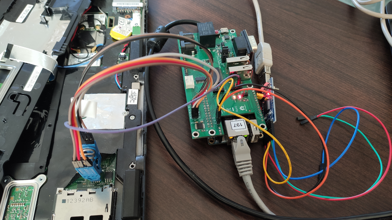

# Flashrom WP test report

## Intro

* Chip name as read from the hardware chip itself: `MX25L6406E`
* Chip name as detected in flashrom: `"MX25L6406E/MX25L6408E"`
* [RTE](https://docs.dasharo.com/transparent-validation/rte/introduction/) was
  used as an external programmer and to control the WP pin state via software
  - any other programmer could be used there instead
* [flash.sh](flash.sh) script was used as a wrapper for flashrom commands -
  please refer there if you need to take a look at the full flashrom commands



## Flashrom version

```shell
root@rte:~# flashrom --version
flashrom v1.2-880-gd047111 on Linux 5.4.69 (armv7l)
flashrom is free software, get the source code at https://flashrom.org

Using clock_gettime for delay loops (clk_id: 1, resolution: 1ns).
```

## Chip detection

```shell
root@rte:~# ./flash.sh probe
set SPI Vcc to 3.3V
SPI lines ON
SPI Vcc ON
Probing ...
flashrom v1.2-880-gd047111 on Linux 5.4.69 (armv7l)
flashrom is free software, get the source code at https://flashrom.org

Using clock_gettime for delay loops (clk_id: 1, resolution: 1ns).
Found Macronix flash chip "MX25L6406E/MX25L6408E" (8192 kB, SPI) on linux_spi.
No operations were specified.
SPI Vcc OFF
SPI lines OFF
```

## WP status

```shell
root@rte:~# ./flash.sh wp-status
set SPI Vcc to 3.3V
SPI lines ON
SPI Vcc ON
Checking WP status ...
flashrom v1.2-880-gd047111 on Linux 5.4.69 (armv7l)
flashrom is free software, get the source code at https://flashrom.org

Using clock_gettime for delay loops (clk_id: 1, resolution: 1ns).
Found Macronix flash chip "MX25L6406E/MX25L6408E" (8192 kB, SPI) on linux_spi.
Protection range: start=0x00000000 length=0x00000000 (none)
Protection mode: disabled
SPI Vcc OFF
SPI lines OFF
```

## WP list

```shell
root@rte:~# ./flash.sh wp-list
set SPI Vcc to 3.3V
SPI lines ON
SPI Vcc ON
Checking WP list ...
flashrom v1.2-880-gd047111 on Linux 5.4.69 (armv7l)
flashrom is free software, get the source code at https://flashrom.org

Using clock_gettime for delay loops (clk_id: 1, resolution: 1ns).
Found Macronix flash chip "MX25L6406E/MX25L6408E" (8192 kB, SPI) on linux_spi.
Available protection ranges:
	start=0x00000000 length=0x00000000 (none)
	start=0x007e0000 length=0x00020000 (upper 1/64)
	start=0x007c0000 length=0x00040000 (upper 1/32)
	start=0x00780000 length=0x00080000 (upper 1/16)
	start=0x00700000 length=0x00100000 (upper 1/8)
	start=0x00600000 length=0x00200000 (upper 1/4)
	start=0x00000000 length=0x00400000 (lower 1/2)
	start=0x00400000 length=0x00400000 (upper 1/2)
	start=0x00000000 length=0x00600000 (lower 3/4)
	start=0x00000000 length=0x00700000 (lower 7/8)
	start=0x00000000 length=0x00780000 (lower 15/16)
	start=0x00000000 length=0x007c0000 (lower 31/32)
	start=0x00000000 length=0x007e0000 (lower 63/64)
	start=0x00000000 length=0x00800000 (all)
SPI Vcc OFF
SPI lines OFF
```

## WP enable

* Set region `0,0x00800000` (whole chip) and enable protection:

```shell
set SPI Vcc to 3.3V
SPI lines ON
SPI Vcc ON
Setting WP region ...
flashrom v1.2-880-gd047111 on Linux 5.4.69 (armv7l)
flashrom is free software, get the source code at https://flashrom.org

Using clock_gettime for delay loops (clk_id: 1, resolution: 1ns).
Found Macronix flash chip "MX25L6406E/MX25L6408E" (8192 kB, SPI) on linux_spi.
Activated protection range: start=0x00000000 length=0x00800000 (all)
Enabling WP region ...
flashrom v1.2-880-gd047111 on Linux 5.4.69 (armv7l)
flashrom is free software, get the source code at https://flashrom.org

Using clock_gettime for delay loops (clk_id: 1, resolution: 1ns).
Found Macronix flash chip "MX25L6406E/MX25L6408E" (8192 kB, SPI) on linux_spi.
Enabled hardware protection
SPI Vcc OFF
SPI lines OFF
```

* Check the status after locking:

```shell
root@rte:~# ./flash.sh wp-status
set SPI Vcc to 3.3V
SPI lines ON
SPI Vcc ON
Checking WP status ...
flashrom v1.2-880-gd047111 on Linux 5.4.69 (armv7l)
flashrom is free software, get the source code at https://flashrom.org

Using clock_gettime for delay loops (clk_id: 1, resolution: 1ns).
Found Macronix flash chip "MX25L6406E/MX25L6408E" (8192 kB, SPI) on linux_spi.
Protection range: start=0x00000000 length=0x00800000 (all)
Protection mode: hardware
SPI Vcc OFF
SPI lines OFF
```

* We can see that the `protection range` was set as desired

* We can see that the `protection mode` was changed to `hardware`

## Test WP protection

* Drive the WP pin LOW:

```shell
root@rte:~# ./flash.sh wp-low
Setting WP pin LOW ...
```

* Try erasing:

```shell
root@rte:~# ./flash.sh erase
set SPI Vcc to 3.3V
SPI lines ON
SPI Vcc ON
Erasing chip ...
flashrom v1.2-880-gd047111 on Linux 5.4.69 (armv7l)
flashrom is free software, get the source code at https://flashrom.org

Using clock_gettime for delay loops (clk_id: 1, resolution: 1ns).
Found Macronix flash chip "MX25L6406E/MX25L6408E" (8192 kB, SPI) on linux_spi.
Unsetting lock bit(s) failed.

WARNING!: Updating only part of the image might render your device unusable if old and
          new parts are not compatible!

          If you think you know what you're doing, pass --skip-wp-area to exclude
          protected part of the flash from the operation.
Your flash chip is in an unknown state.
Please report this to the mailing list at flashrom@flashrom.org or
on IRC (see https://www.flashrom.org/Contact for details), thanks!
SPI Vcc OFF
SPI lines OFF
```

## Disable WP protection

* Set region `0,0` and disable protection (with WP pin still being LOW):

```shell
root@rte:~# ./flash.sh wp-disable
set SPI Vcc to 3.3V
SPI lines ON
SPI Vcc ON
Disabling WP protection ...
flashrom v1.2-880-gd047111 on Linux 5.4.69 (armv7l)
flashrom is free software, get the source code at https://flashrom.org

Using clock_gettime for delay loops (clk_id: 1, resolution: 1ns).
Found Macronix flash chip "MX25L6406E/MX25L6408E" (8192 kB, SPI) on linux_spi.
Failed to apply new WP settings: unexpected WP configuration read back from chip
Note: hardware status register protection is enabled. The chip's WP# pin must be set to an inactive voltage level to be able to change the WP settings.
Clearing WP region ...
flashrom v1.2-880-gd047111 on Linux 5.4.69 (armv7l)
flashrom is free software, get the source code at https://flashrom.org

Using clock_gettime for delay loops (clk_id: 1, resolution: 1ns).
Found Macronix flash chip "MX25L6406E/MX25L6408E" (8192 kB, SPI) on linux_spi.
Failed to apply new WP settings: unexpected WP configuration read back from chip
Note: hardware status register protection is enabled. The chip's WP# pin must be set to an inactive voltage level to be able to change the WP settings.
SPI Vcc OFF
SPI lines OFF
```

* The protection cannot be disabled by software as long as the WP pin is LOW

* Drive the WP pin HIGH:

```shell
root@rte:~# ./flash.sh wp-high
Setting WP pin HIGH ...
```

* Set region `0,0` and disable protection (with WP pin HIGH already):

```shell
root@rte:~# ./flash.sh wp-disable
set SPI Vcc to 3.3V
SPI lines ON
SPI Vcc ON
Disabling WP protection ...
flashrom v1.2-880-gd047111 on Linux 5.4.69 (armv7l)
flashrom is free software, get the source code at https://flashrom.org

Using clock_gettime for delay loops (clk_id: 1, resolution: 1ns).
Found Macronix flash chip "MX25L6406E/MX25L6408E" (8192 kB, SPI) on linux_spi.
Disabled hardware protection
Clearing WP region ...
flashrom v1.2-880-gd047111 on Linux 5.4.69 (armv7l)
flashrom is free software, get the source code at https://flashrom.org

Using clock_gettime for delay loops (clk_id: 1, resolution: 1ns).
Found Macronix flash chip "MX25L6406E/MX25L6408E" (8192 kB, SPI) on linux_spi.
Activated protection range: start=0x00000000 length=0x00000000 (none)
SPI Vcc OFF
SPI lines OFF
```

* Check the `wp-status` again:

```shell
root@rte:~# ./flash.sh wp-status
set SPI Vcc to 3.3V
SPI lines ON
SPI Vcc ON
Checking WP status ...
flashrom v1.2-880-gd047111 on Linux 5.4.69 (armv7l)
flashrom is free software, get the source code at https://flashrom.org

Using clock_gettime for delay loops (clk_id: 1, resolution: 1ns).
Found Macronix flash chip "MX25L6406E/MX25L6408E" (8192 kB, SPI) on linux_spi.
Protection range: start=0x00000000 length=0x00000000 (none)
Protection mode: disabled
SPI Vcc OFF
SPI lines OFF
```

* We can see that the `protection range` was set as desired

* We can see that the `protection mode` was changed to `disabled`
